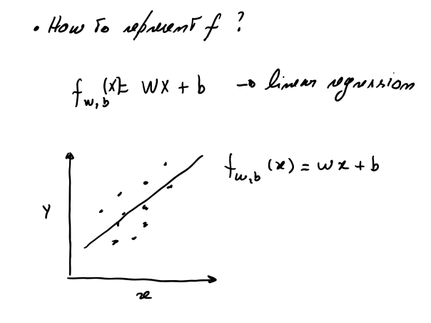
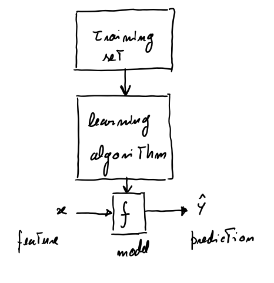
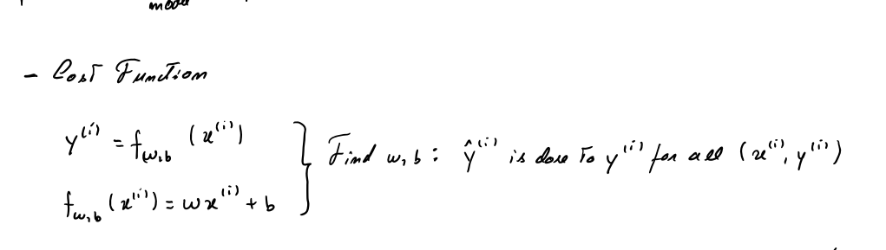
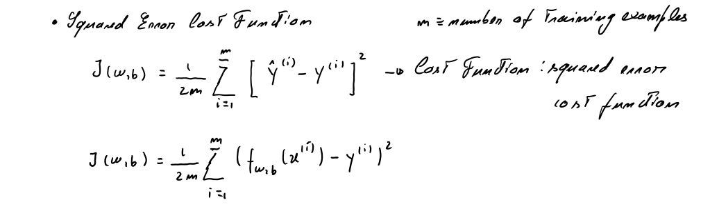
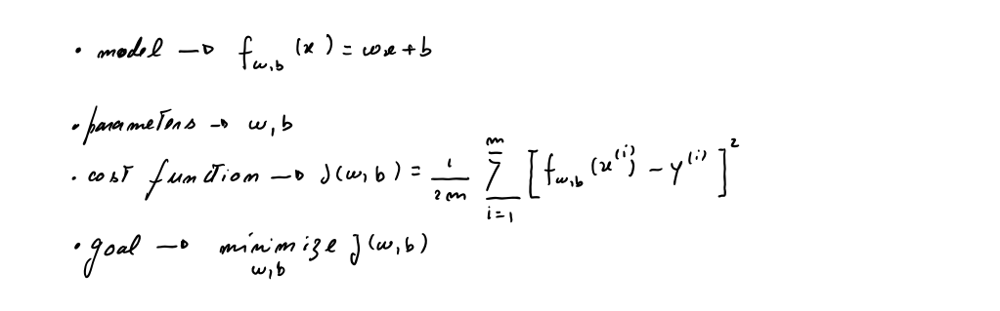

# Machine Learning & Deep Learning

## Regressão Linear

1. Representação do Modelo
2. Função de Custo

### 1. Representação do Modelo

### Objectivo

Vamos implementar o modelo $f_{w,b}$ para regressão linear com uma variável.

### Problema

Consideremos o caso simples da previsão do preço das casas.Por simplicidade consideremos apenas dois pontos de dados:


| Size (1000 sqft)     | Price (1000s of dollars) |
| -------------------| ------------------------ |
| 1.0               | 300                      |
| 2.0               | 500                      |

Queremos ajustar um modelo de regressão linear (linha preta no gráfico) a estes dados de forma a que possamos depois saber,por exemplo, qual o preço de uma casa com 1200 sqft



Consideremos os seguintes vectores:

```
final DLVector xTrain = new DLVector(new double[]{1.0, 2.0});
final DLVector yTrain = new DLVector(new double[]{300.0, 500.0});
LOG.info(String.format("xTrain: %s", xTrain));
LOG.info(String.format("yTrain: %s", yTrain));
```
```
INFO: xTrain: [ 1.0, 2.0]
INFO: yTrain: [ 300.0, 500.0]
```

#### Número de exemplos de treino

Se $m$ for o número de exemplos de treino, temos:

```
final int m = xTrain.dimension();
LOG.info(String.format("Número de exemplos de treino: %d", m));
```

```
INFO: Número de exemplos de treino: 2
```

Vamos usar ($x^{(i)}$, $y^{(i)}$) para referir o exemplo de treino $i$

### A função modelo



A função modelo para a regressão linear (que é uma função que mapeia valores de $x$ para $y$) é representada como:

```
$$ f_{w,b}(x^{(i)}) = wx^{(i)} + b \tag{1}$$
```

Vamos calcular alguns valores de  $f_{w,b}(x^{(i)})$ para os dois pontos de dados:

Para $x^{(0)}$, `f_wb = w * x[0] + b`

Para $x^{(1)}$, `f_wb = w * x[1] + b`

```
    /**
     * @param xTrain Valores de treino
     * @param w Parâmetro do modelo
     * @param b Parâmetro do modelo
     * @return  Valores alvo
     */
    public static DLVector computeModelOutput(final DLVector xTrain, final double w, final double b){
        final int m = xTrain.dimension();
        final double[] f_wb = new double[m];
        for (int i = 0; i < m; i++) {
            f_wb[i] = w * xTrain.component(i) + b;
        }
        return new DLVector(f_wb);
    }
```
**Nota**: Ver classe **pt.deeplearning.LinearRegression.java**

### Previsão

Agora que temos o modelo, podemos fazer algumas previsões. O mais importante é calcular os valores ideias dos parâmetros $w$ e $b$.
Por hora suponhamos que já temos bons valores para $w$ e $b$. Então, por exemplo, para prever o preço de uma casa com 1200sqft, temos:

```
final double xi = 1.2;
final double w = 200.0;
final double b = 100.0;
final double cost1200sqft = w * xi + b;
LOG.info(String.format("Preço previsto para uma casa de %s sqft: %f", xi*1000, cost1200sqft));
```
```
INFO: Preço previsto para uma casa de 1200.0 sqft: 340,000000
```
### 2. Função de Custo

### Objectivo

Implementar a função de custo para a regressão linear com uma variável.

### Problema

Queremos um modelo que faça previsões de preços de casas quando lhe é dado o tamanho da casa.
Vamos continuar com os mesmos dados:


| Size (1000 sqft)     | Price (1000s of dollars) |
| -------------------| ------------------------ |
| 1.0               | 300                      |
| 2.0               | 500                      |

### Calcular o Custo



Neste contexto o custo é uma medida de quão bem o nosso modelo se está a comportar na previsão do preço das casas dados os seus tamanhos. No fundo é uma medida que nos permite avaliar se o nosso modelo está a fazer boas ou más previsões de preços.
A equação para o custo, com uma variável é

$J(w,b) = \frac{1}{2m} \sum\limits_{i = 0}^{m-1} (f_{w,b}(x^{(i)}) - y^{(i)})^2 \tag{1}$

onde

$$f_{w,b}(x^{(i)}) = wx^{(i)} + b \tag{2}$$

- $f_{w,b}(x^{(i)})$ é a nossa previsão para o exemplo $i$ usando os parâmetros $w,b$.
- $(f_{w,b}(x^{(i)}) -y^{(i)})^2$ é o quadrado da diferença entre o valor alvo e a previsão
- Estas diferenças são somadas sobre todos os  $m$ exemplos e divididos por `2m` para produzir o custo  $J(w,b)$.  



O custo calcula-se iterando sobre os exemplos.

- `f_wb`, uma previsão é calculada
- a diferença entre o valor real e o previsto é calculado e elevado ao quadrado.
- esse valor é adicionado ao custo total
A seguinte função calula o custo:

```
    /**
     *
     * @param x Dados. m exemplos
     * @param y Valores alvo
     * @param w Parâmetros do modelo
     * @param b Parâmetros do modelo
     * @return O custo total. O custo de usar os valores w e b como parâmetros para a regressão
     * linear 
     */
    public static double computeCost(final DLVector x, final DLVector y, final double w, final double b){
        // Número de exemplos de treino
        final int m = x.dimension();
        double costSum = 0.0;
        for (int i = 0; i < m; i++){
            final double f_wb = w * x.component(i) + b;
            final double cost = Math.pow(f_wb - y.component(i), 2);
            costSum += cost;
        }
        final double totalCost = (1.0 / (2.0 * m)) * costSum;
        return totalCost;
    }

```
