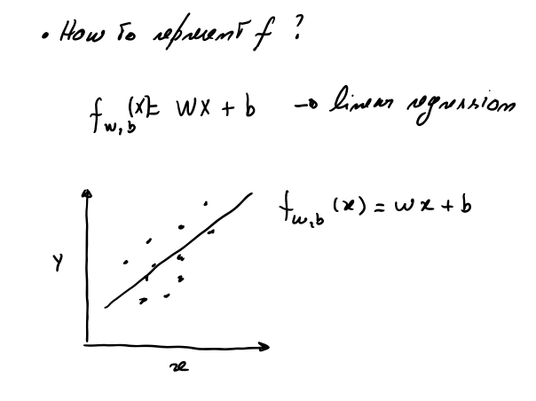
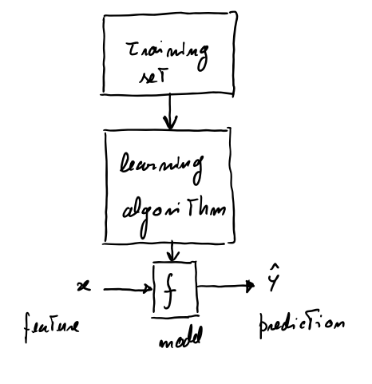
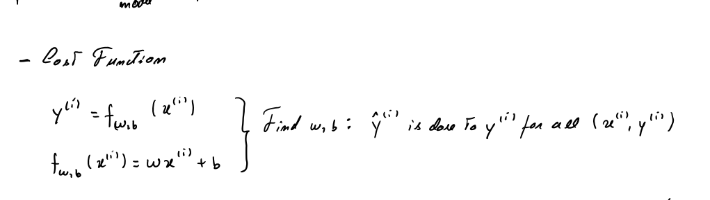
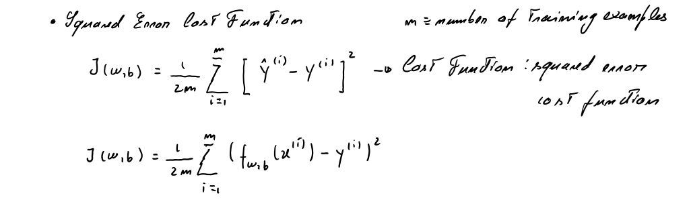
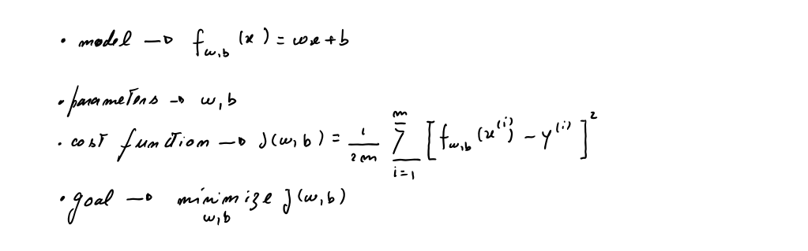
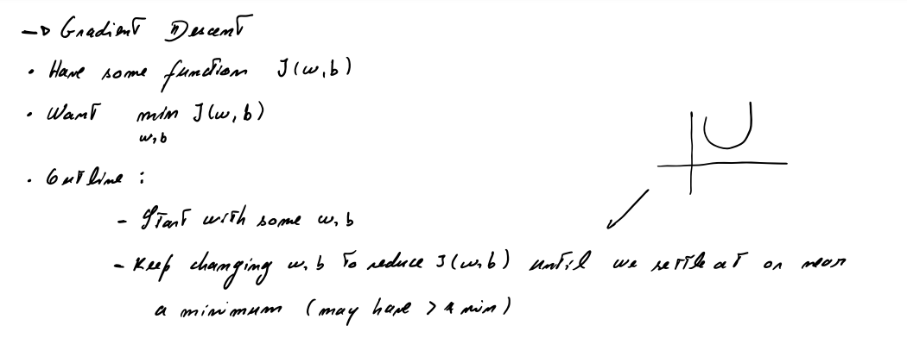
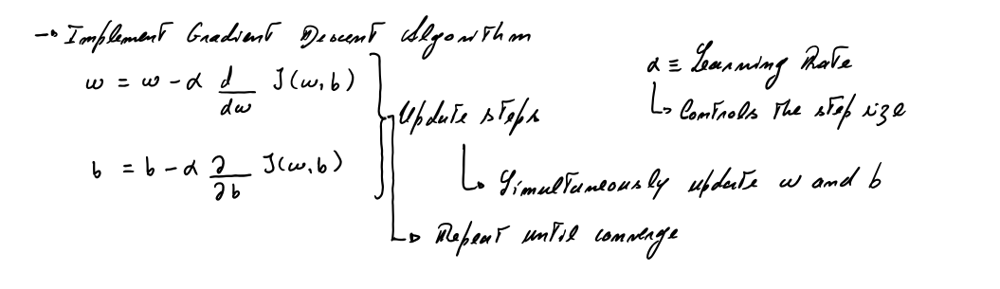
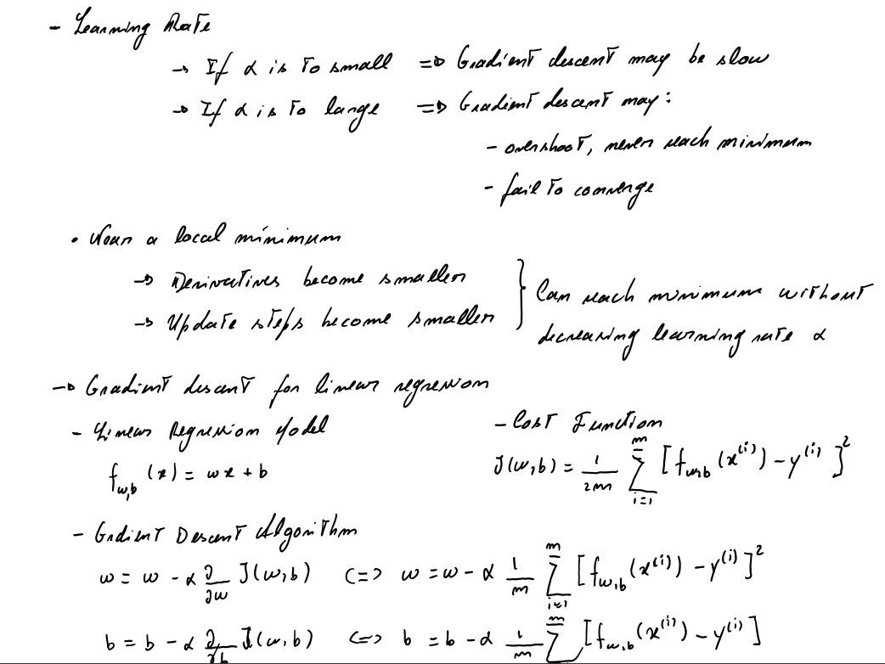
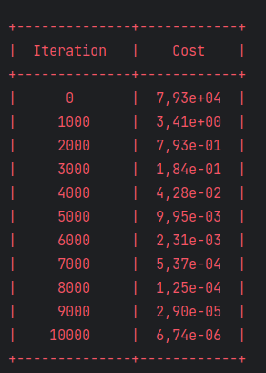
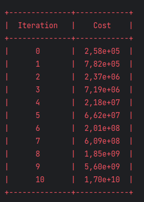

# Machine Learning & Deep Learning

## Regressão Linear

1. Representação do Modelo
2. Função de Custo
3. Gradiente Descendente

### 1. Representação do Modelo

### Objectivo

Vamos implementar o modelo $f_{w,b}$ para regressão linear com uma variável.

### Problema

Consideremos o caso simples da previsão do preço das casas.Por simplicidade consideremos apenas dois pontos de dados:


| Size (1000 sqft)     | Price (1000s of dollars) |
| -------------------| ------------------------ |
| 1.0               | 300                      |
| 2.0               | 500                      |

Queremos ajustar um modelo de regressão linear (linha preta no gráfico) a estes dados de forma a que possamos depois saber,por exemplo, qual o preço de uma casa com 1200 sqft



Consideremos os seguintes vectores:

```java
final DLVector xTrain = new DLVector(new double[]{1.0, 2.0});
final DLVector yTrain = new DLVector(new double[]{300.0, 500.0});
LOG.info(String.format("xTrain: %s", xTrain));
LOG.info(String.format("yTrain: %s", yTrain));
```
```
INFO: xTrain: [ 1.0, 2.0]
INFO: yTrain: [ 300.0, 500.0]
```

#### Número de exemplos de treino

Se $m$ for o número de exemplos de treino, temos:

```java
final int m = xTrain.dimension();
LOG.info(String.format("Número de exemplos de treino: %d", m));
```

```
INFO: Número de exemplos de treino: 2
```

Vamos usar ($x^{(i)}$, $y^{(i)}$) para referir o exemplo de treino $i$

### A função modelo



A função modelo para a regressão linear (que é uma função que mapeia valores de $x$ para $y$) é representada como:

$$ f_{w,b}(x^{(i)}) = wx^{(i)} + b \tag{1}$$

Vamos calcular alguns valores de  $f_{w,b}(x^{(i)})$ para os dois pontos de dados:

Para $x^{(0)}$, `f_wb = w * x[0] + b`

Para $x^{(1)}$, `f_wb = w * x[1] + b`

```java
    /**
     * @param xTrain Valores de treino
     * @param w Parâmetro do modelo
     * @param b Parâmetro do modelo
     * @return  Valores alvo
     */
    public static DLVector computeModelOutput(final DLVector xTrain, final double w, final double b){
        final int m = xTrain.dimension();
        final double[] f_wb = new double[m];
        for (int i = 0; i < m; i++) {
            f_wb[i] = w * xTrain.component(i) + b;
        }
        return new DLVector(f_wb);
    }
```
**Nota**: Ver classe **pt.deeplearning.LinearRegressionTest.java**

### Previsão

Agora que temos o modelo, podemos fazer algumas previsões. O mais importante é calcular os valores ideias dos parâmetros $w$ e $b$.
Por hora suponhamos que já temos bons valores para $w$ e $b$. Então, por exemplo, para prever o preço de uma casa com 1200sqft, temos:

```java
final double xi = 1.2;
final double w = 200.0;
final double b = 100.0;
final double cost1200sqft = w * xi + b;
LOG.info(String.format("Preço previsto para uma casa de %s sqft: %f", xi*1000, cost1200sqft));
```
```
INFO: Preço previsto para uma casa de 1200.0 sqft: 340,000000
```
### 2. Função de Custo

### Objectivo

Implementar a função de custo para a regressão linear com uma variável.

### Problema

Queremos um modelo que faça previsões de preços de casas quando lhe é dado o tamanho da casa.
Vamos continuar com os mesmos dados:


| Size (1000 sqft)     | Price (1000s of dollars) |
| -------------------| ------------------------ |
| 1.0               | 300                      |
| 2.0               | 500                      |

### Calcular o Custo



Neste contexto o custo é uma medida de quão bem o nosso modelo se está a comportar na previsão do preço das casas dados os seus tamanhos. No fundo é uma medida que nos permite avaliar se o nosso modelo está a fazer boas ou más previsões de preços.
A equação para o custo, com uma variável é

$$J(w,b) = \frac{1}{2m} \sum\limits_{i = 0}^{m-1} (f_{w,b}(x^{(i)}) - y^{(i)})^2 \tag{1}$$

onde

$$f_{w,b}(x^{(i)}) = wx^{(i)} + b \tag{2}$$

- $f_{w,b}(x^{(i)})$ é a nossa previsão para o exemplo $i$ usando os parâmetros $w,b$.
- $(f_{w,b}(x^{(i)}) -y^{(i)})^2$ é o quadrado da diferença entre o valor alvo e a previsão
- Estas diferenças são somadas sobre todos os  $m$ exemplos e divididos por `2m` para produzir o custo  $J(w,b)$.  



O custo calcula-se iterando sobre os exemplos.

- `f_wb`, uma previsão é calculada
- a diferença entre o valor real e o previsto é calculado e elevado ao quadrado.
- esse valor é adicionado ao custo total
A seguinte função calula o custo:

```java
    /**
     *
     * @param x Dados. m exemplos
     * @param y Valores alvo
     * @param w Parâmetros do modelo
     * @param b Parâmetros do modelo
     * @return O custo total. O custo de usar os valores w e b como parâmetros para a regressão
     * linear 
     */
    public static double computeCost(final DLVector x, final DLVector y, final double w, final double b){
        // Número de exemplos de treino
        final int m = x.dimension();
        double costSum = 0.0;
        for (int i = 0; i < m; i++){
            final double f_wb = w * x.component(i) + b;
            final double cost = Math.pow(f_wb - y.component(i), 2);
            costSum += cost;
        }
        final double totalCost = (1.0 / (2.0 * m)) * costSum;
        return totalCost;
    }

```
**Resumo:**



### 3. Gradiente Descendente



### Objectivo

Automatizar o processo de otimização de $w$ e $b$ usando o gradiente descendente.

### Problema

Mantemos as mesmas condições anteriores, i.e., temos os seguintes dados:

| Size (1000 sqft)     | Price (1000s of dollars) |
| -------------------| ------------------------ |
| 1.0               | 300                      |
| 2.0               | 500                      |

E temos a função para calcular o custo (já definida anteriormente):

```java
public static double computeCost(final DLVector x, final DLVector y, final double w, final double b){...}
```

### Gradiente Descendente


Até agora desenvolvemos um modelo linear que prevê $f_{w,b}(x^{(i)})$:
$$f_{w,b}(x^{(i)}) = wx^{(i)} + b \tag{1}$$

Na regressão linear, usamos os dados de entrada para ajustar os parâmetros $w$, $b$ através da minimização da medida de erro entre a nossa previsão $f_{w,b}(x^{(i)})$ e os dados atuais $y^{(i)}$. A medida é chamada de custo, $J(w,b)$. Na fase de treino medimos o custo sobre todos os exemplos de treino $x^{(i)},y^{(i)}$
$$J(w,b) = \frac{1}{2m} \sum\limits_{i = 0}^{m-1} (f_{w,b}(x^{(i)}) - y^{(i)})^2\tag{2}$$ 


O gradiente descendente é descrito como:

$$\begin{align*} \text{repeat}&\text{ until convergence:} \; \lbrace \newline
\;  w &= w -  \alpha \frac{\partial J(w,b)}{\partial w} \tag{3}  \; \newline
b &= b -  \alpha \frac{\partial J(w,b)}{\partial b}  \newline \rbrace
\end{align*}$$

onde os parâmetros $w$, $b$ sofrem um update em simultâneo.  

O gradiente é definido como:

$$\begin{align}
\frac{\partial J(w,b)}{\partial w}  &= \frac{1}{m} \sum\limits_{i = 0}^{m-1} (f_{w,b}(x^{(i)}) - y^{(i)})x^{(i)} \tag{4}\\
\frac{\partial J(w,b)}{\partial b}  &= \frac{1}{m} \sum\limits_{i = 0}^{m-1} (f_{w,b}(x^{(i)}) - y^{(i)}) \tag{5}\\
\end{align}$$

### Implementação do Gradiente Descendente

Vamos implementar o gradiente descendente para uma variável de entrada (no nosso exemplo é o tamanho da casa). Vamos precisar de três funções:

- `computeGradient` Implementação das equações (4) e (5) acima
- `computeCost` Implementação da equação (2). Já foi feito (ver acima)
- `gradientDescent` Implementar usando o computeGradient e computeCost

Convenção: Usamos a seguinte notação: $\frac{\partial J(w,b)}{\partial b}$  será `dj_db` e assim por diante.

`computeGradient` implementa as equações (4) e (5) e retorna $\frac{\partial J(w,b)}{\partial w}$,$\frac{\partial J(w,b)}{\partial b}$

```java
    /**
     * Calcula o gradiente para a regressão linear
     * @param x Dados, m exemplos
     * @param y Valores alvo
     * @param w Parâmetro do modelo
     * @param b Parâmetro do modelo
     * @return GradientCost um DTO com duas variáveis:<br>
     * dJdW ≥ O gradiente do custo relativamente aoparâmetro w<br>
     * dJdB ≥ O gradiente do custo relativamente ao parâmetro b
     */
    public static GradientCost computeGradient(final DLVector x, final DLVector y, final double w, final double b) {
        // Número de exemplos de treino
        final int m = x.dimension();
        double dJdW = 0.0;
        double dJdB = 0.0;
        for (int i = 0; i < m; i++) {
            final double f_wb = w * x.component(i) + b;
            final double dJdWi = (f_wb - y.component(i)) * x.component(i);
            final double dJdBi = f_wb - y.component(i);
            dJdW += dJdWi;
            dJdB += dJdBi;
        }
        dJdW /= m;
        dJdB /= m;
        return new GradientCost(dJdW, dJdB);
    }
```

### Gradiente Descendente
Agora que os gradientes já podem ser calculados, precisamos de uma última função para calcular o gradiente:



```java
    /**
     * Executa o algoritmo do gradiente descendente para ajustar os parâmetros w e b.
     * Estes parâmetros (w e b) vão sendo atualizados à medida que o número de iterações,
     * numIters vai aumentando
     * @param wIn Valor inicial para w
     * @param bIn Valor inicial para b
     * @return um objeto GradientDescent com os valores finais de w, b e ainda duas listas
     * com dados históricos
     */
    public GradientDescent gradientDescent(final double wIn, final double bIn) {

        // Duas listas para guardar os dados intermédios da computação. Serão usados para
        // mostrar a evolução do gradiente graficamente
        final List<Double> jHistory = new ArrayList<>();
        final List<Pair<Double, Double>> pHistory = new ArrayList<>();

        double b = bIn;
        double w = wIn;
        int i = 0;
        while (i <= numIters) {
            // Cálcula o gradiente e faz um update aos parâmetros usando a função computeGradient
            final GradientCost gradientCost = computeGradient(w, b);
            // Update aos parâmetros
            b = b - alpha * gradientCost.dJdB();
            w = w - alpha * gradientCost.dJdW();
            // Grava o custo J até ao máximo de 100000 para evitar exaustão de recursos
            if (i < 100000) {
                jHistory.add(computeCost(w, b));
                pHistory.add(new Pair<>(w, b));

            }
            i++;
        }
        return new GradientDescent(w, b, jHistory, pHistory);
    }
```

A classe com estes métodos é:

***pt.deeplearning.supervised.regression.linear.LinearRegression***

Esta classe está ligeiramente diferente do apresentado aqui mas por questões de arrumação do código.

Então, correndo esta classe,

```java
    // Dados de treino
        final DLVector xTrain = new DLVector(new double[]{1.0, 2.0});
        final DLVector yTrain = new DLVector(new double[]{300.0, 500.0});
        // Initialize parameters
        final double w_init = 0.0;
        final double b_init = 0.0;
        // Some gradiente descent settings
        final int iterations = 10000;
        final double tmp_alpha = 1.0e-2;
        // Run gradient descent
        final LinearRegression linearRegression = new LinearRegression(xTrain, yTrain, tmp_alpha, iterations);
        final GradientDescent gradientDescent = linearRegression.gradientDescent(w_init, b_init);
        LOG.info(String.format("(w, b) found by gradient descent:( %8.4f, %8.4f)",
                gradientDescent.w(), gradientDescent.b()));
```

```
INFO: (w, b) found by gradient descent:( 199,9929, 100,0116)
```

Utilizando o histórico do custo,

```java
//Show iterations vs cost
        final TableGenerator tableGenerator = new TableGenerator();
        final List<String> headerList = list("Iteration", "Cost");
        final List<Double> costHistory = gradientDescent.jHistory();
        final List<List<String>> dataList =
        IntStream.range(0, costHistory.size())
                .filter(i -> i % Math.ceil((double) iterations / 10) == 0)
                .mapToObj(i -> list(String.valueOf(i), String.valueOf(costHistory.get(i))))
                .collect(Collectors.toList());
        LOG.info("\n" + tableGenerator.generateTable(headerList, dataList));
```



Com estes dados podemos constatar que o custo começa elevado mas rapidamente decai

### Custo Vs iterações no Gradiente Descendente

Ver graficamente o custo vs iterações é dos melhores indicadores do progresso do gradiente descendente:
- O custo deve sempre diminuir entre épocas sucessivas. Se isto não acontecer é porque muito provavelmente há um erro.

- 

### Previsões

Agora que descobrimos os valores ótimos dos parâmetros $\w$ e $\b$ podemos começar a usar o modelo para prever os preços das casas:

```java
DLVector values = new DLVector(new double[]{1.0, 1.2, 2.0});
DLVector previsions = linearRegression.computeModelOutput(values, gradientDescent.w(), gradientDescent.b());
LOG.info(String.format("Valor previsto para uma casa com 1000 metros quadrados: %.2f", previsions.component(0)));
LOG.info(String.format("Valor previsto para uma casa com 1200 metros quadrados: %.2f", previsions.component(1)));
LOG.info(String.format("Valor previsto para uma casa com 2000 metros quadrados: %.2f", previsions.component(2)));
```

```
INFO: Valor previsto para uma casa com 1000 metros quadrados: 300,00
INFO: Valor previsto para uma casa com 1200 metros quadrados: 340,00
INFO: Valor previsto para uma casa com 2000 metros quadrados: 500,00
```

Como esperado, os valores previstos são praticamente iguais aos valores usados como treino. O valor que não está no treino apresenta uma previsão em linha com o esperado.

### Alterar a taxa de aprendizagem (learning rate)

A taxa de aprendizagem, $\alpha$ no código pode acelerar ou atrasar a convergência do gradiente descendente.

Se a taxa for grande, o gradiente converge mais rapidamente mas se for grande demais, pode fazer com que o gradiente divirja (overshoot).

Se a taxa for muito pequena a convegência é mais lenta.

Vamos ver, por exemplo, com um valor elevado:




Claramente o custo está a aumentar. Isto é um indicador que a taxa de aprendizagem é muito grande e a solução está a divergir. 